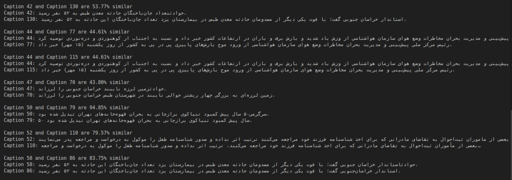

# Text Similarity and Clustering

This project analyzes text data using natural language processing (NLP) techniques to find similarity between captions, leveraging TF-IDF and cosine similarity. Additionally, it clusters captions using DBSCAN and calculates evaluation metrics like silhouette score and Davies-Bouldin index.

## Recommended Threshold

> **⚠️ Important:** For optimal results, it is recommended to set the similarity threshold to **40%**. This threshold balances precision and recall, ensuring that similar captions are accurately identified without including too many false positives.

## Example Image

Below is an example image that illustrates the clustering process:




## Features

- **Text Preprocessing**: Removes special characters and stopwords, and performs lemmatization.
- **TF-IDF Vectorization**: Converts text to vectors for comparison.
- **Cosine Similarity**: Calculates similarity between pairs of captions.
- **DBSCAN Clustering**: Groups similar captions.
- **Similarity Thresholds**: Saves pairs of captions that meet similarity thresholds.
- **Memory Profiling**: Tracks memory usage of the program.

## Setup

1. Install the required Python packages:
   ```bash
   pip install -r requirements.txt
   ```
   
2. Download necessary NLTK resources( automatically download in every runs ):
   ```python
   import nltk
   nltk.download('stopwords')
   nltk.download('punkt')
   nltk.download('wordnet')
   ```

## How to Use

1. **Input**: Place your text data in a file named `captions.txt`.
2. **Run the Script**: Preprocess captions, calculate TF-IDF vectors, and find similar pairs of captions:
   ```bash
   python main.py
   ```
3. **Output**: Similar caption pairs for different thresholds (10% to 100%) are saved in result texts like `similar_pairs_10-100%.txt`.

Sample Output file (`similar_pairs_10-100%.txt`):
```
Caption 0 and Caption 1 are 72.50% similar
Caption 0: This is a sample caption.
Caption 1: Another sample text.
```

## TODO

- [ ] instead of working with pairs , use group text Clustering ✔️
- [ ] Implement a method to support list and dict of texts ✔️
- [ ] OOP optimization ✔️
- [ ] Support multitext files and texts ✔️
- [ ] run just using a method ✔️
